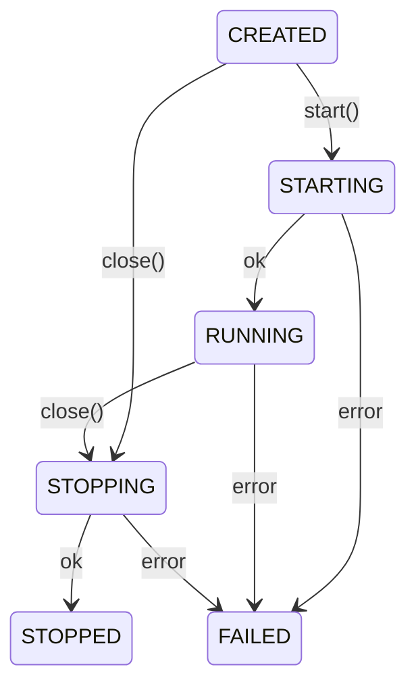

# Freeway Framework
<div align="left">
  
  <p>Compose-First · Full-Featured · Zero-Dependency · High-Performance · Concise & Tasteful.</p>
</div>

[](https://central.sonatype.com/artifact/com.jujin8.freeway/freeway-parent)
[](LICENSE)
[](https://jdk.java.net/25/)
[]()

**A modern, full-featured, high-performance Java application framework for JDK 25+. Zero dependencies — SLF4J API only.**

Lightweight. **Compose-first.** Zero classpath scanning. IoC, HTTP, DB, Flow — everything in one coherent design.

Freeway exists to show that a Java framework can be **concise without being shallow,
complete without being bloated.** It is an exercise in **engineering aesthetics** —
every API deliberate, every concept pulling its weight. In an ecosystem where
ceremony is often mistaken for rigor, Freeway bets that **clarity, simplicity, and
good taste** still have a place.

| Module | Description                                               |
|--------|-----------------------------------------------------------|
| `freeway-commons` | Shared utilities: JSON, coercion, scoped primitives, logging |
| `freeway-ioc` | IoC container: bind, inject, coerce, advise, event-bus    |
| `freeway-boot` | Application launcher, config, profiles, runtime lifecycle |
| `freeway-http` | HTTP layer: routing, filters, static, multipart, WebSocket |
| `freeway-db` | JDBC data access: ORM, pooling, transactions, migrations |
| `freeway-flow` | Graph workflow engine — 7 node types, v2 DAG format, `!marker` task resolution |
| `freeway-mq-kafka` | Kafka EventBus bridge — available in [freeway-ext](https://github.com/dzb/freeway-ext) |

Core modules have **zero external dependencies.** Third-party adapters live in
**[freeway-ext](https://github.com/dzb/freeway-ext)**. Pick only what you need.

## Philosophy

Freeway 2 is a **compose-first** framework. Instead of scanning the classpath,
applications explicitly wire modules together:

```java
Freeway.create(
    binder -> binder.bind(Greeter.class).to(GreeterImpl.class),
    binder -> binder.bind(Store.class).to(Store.class)
);
```

This gives you:

- **Fast startup** — no bytecode scanning, no classpath crawling.
- **Total control** — every binding is explicit, **no magic.**
- **Small footprint** — core modules have **zero external dependencies** (SLF4J API only).
- **Aesthetic coherence** — APIs read like the intent they express, not the machinery underneath.

Freeway rejects the idea that enterprise Java must be verbose, annotation-riddled,
and XML-laden. It offers a quieter, more deliberate alternative: fewer concepts,
sharper boundaries, and code that looks like it was written by someone who cares.

## Core Design

Freeway 2 keeps its core concepts intentionally small:

- `Module` is the unit of application composition and responsibility partitioning. `ModuleEx` is the Java type name used by Freeway. Modules carry `@Marker` annotations to tag all their bindings (e.g. `@Marker(Builtin.class)`).
- `Freeway` builds a container; `FreewayApp` builds a runtime.
- `Container` is the **service lookup boundary**: `get(Class)`, `get(Class, String)`, `get(Class, Annotation...)`, `extension(Class)`, `create(Class)`, `close()`. `create()` **injects without caching.** Container is a framework boundary type — accessed via `Freeway.create()`, `RuntimeHook`, or provider lambdas, not via `@Inject`.
- `AppRuntime` owns startup, shutdown, profiles, config, and runtime hooks.
- Service ids are **plain strings**: `.id("stripe")`, `get(PaymentGateway.class, "stripe")`. There is **no public `ServiceId` type.**
- Service lifecycles are declared only through `bind().scope(...)`: `SINGLETON`, `PROTOTYPE`, `THREAD`.
- `Scoping` executes work inside a `Scope.THREAD` boundary via `within()`, backed by JDK 25 `ScopedValue`.
- `RuntimeHook` is the module-level start/stop extension. Hooks are contributed through the normal contribution mechanism and can be ordered with `before/after`.
- `HttpModule` contributes the HTTP server hook with stable id `freeway.http.server`; app launch starts and stops the server through `AppRuntime`.
- `LoggerSource` is the built-in logger service. Commons provides a JUL-backed SLF4J 2 provider with ANSI-colored console output and configurable file logging (single or multi-file) with time+size rotation and GZIP compression. Configured via `freeway-log.properties` or `-D` flags. Zero-dependency fallback; drop in Logback for advanced needs.
- Framework-provided implementation names use the **`XDefault` suffix** form, such as `AppRuntimeDefault`, `JsonCodecDefault`, and `RequestContextDefault`.

See [freeway-module.md](docs/freeway-module.md) and [freeway-commons.md](docs/freeway-commons.md) for deeper module notes.

## Quick Start

```java
public final class AppModule implements ModuleEx {
    @Override
    public void bind(Binder binder) {
        binder.bind(Greeter.class).to(GreeterImpl.class);
    }
}

AppRuntime runtime = FreewayApp.run(
    new String[] {"--freeway.profile=dev"},
    new AppModule()
);
Greeter greeter = runtime.get(Greeter.class);
System.out.println(greeter.greet("World"));
runtime.close();
```

Or compose inline without boot:

```java
Container container = Freeway.create(
    binder -> binder.bind(Greeter.class).to(GreeterImpl.class)
);
```

### Web App

```java
public final class App implements ModuleEx {
    @Override
    public void bind(Binder b) {
        b.install(new HttpModule());

        b.contribute(Route.class)
            .add(Route.get("/", ctx ->
                ctx.send(200, "Hello Freeway")))
            .add(Route.get("/users/{id}", ctx ->
                ctx.sendJson(200, Map.of(
                    "id", ctx.pathVar("id").orElse(""),
                    "name", "Alice"
                ))));
    }

    public static void main(String[] args) {
        FreewayApp.run(args, new App());
    }
}
```

```bash
curl http://localhost:8080/           # Hello Freeway
curl http://localhost:8080/users/42   # {"id":"42","name":"Alice"}
```

## Build

Requires JDK 25.

```bash
mvn test
mvn -pl freeway-ioc test
mvn -pl freeway-http -am test
mvn -pl freeway-db -am test
```

## Modules at a Glance

### Commons (`freeway-commons`)

Shared utilities usable independently of the framework:

- JSON — `JsonCodec` for object↔JSON mapping, `JsonUtils` for parsing/serialization.
- Coercion — `Coercer` type conversion with pluggable `CoerceRule` extensions.
- Scoped primitives — `Defer` buffers commit-time side effects; `ScopedCache` memoizes values for the lifetime of a scope and runs cleanup on exit.
- Bean — `BeanIntrospector`/`BeanPlan` for record/bean reflection.
- Validation — `@NotNull`/`@NotBlank`/`@Size`/`@Min`/`@Max`/`@Valid` with `BeanValidator`.
- **Logging** — built-in SLF4J 2 provider backed by JUL, with ANSI-colored console and time+size rotating file output (see [Logging](#logging) below).

### Logging

Freeway uses **SLF4J 2** as its logging API — `LoggerFactory.getLogger()` everywhere, in framework code and user code alike. No logging framework dependency at compile time.

**Zero-dependency fallback:** When no external SLF4J provider (Logback, Log4j) is on the classpath, `freeway-commons` activates its built-in JUL-backed provider automatically. Console output with ANSI colors, rotating file logging, and per-logger level control all work **with zero configuration** — no XML, no `logging.properties`, no extra dependencies.

**Seamless upgrade to Logback:** Add one dependency and SLF4J switches to Logback automatically. No code changes, no config conflicts.

```xml
<dependency>
    <groupId>ch.qos.logback</groupId>
    <artifactId>logback-classic</artifactId>
</dependency>
```

**Configuration** via `freeway-log.properties` on the classpath root. Priority: `-D` > `FREEWAY_` env vars > config file > code defaults.

```properties
freeway.log.level=INFO
freeway.log.console.enabled=true
freeway.log.console.level=INFO
freeway.log.file=auto                    # logs/{app.name}.log, rotation + GZIP
```

**Multi-file logging** — declare named files with independent paths, rotation settings, and logger binding:

```bash
-Dfreeway.log.files=audit
-Dfreeway.log.file.audit.path=logs/audit.log
-Dfreeway.log.file.audit.logger=com.myapp.audit
-Dfreeway.log.file.audit.level=FINE
```

**Per-logger level control** — any key ending with `.level` sets the corresponding JUL logger:

```bash
-Dcom.myapp.audit.level=FINE
-Dorg.hibernate.level=WARNING
```

See [docs/DEVELOPER-GUIDE.md](docs/DEVELOPER-GUIDE.md#logging-service) and [docs/freeway-log.properties.reference](docs/freeway-log.properties.reference) for the full reference.

### IoC (`freeway-ioc`)

The IoC module provides the framework core:

- Service binding - `binder.bind(X.class).to(Y.class)`.
- Named services - `.id("primary")`.
- Primary resolution - `.primary()` for the default binding when no id is supplied.
- Scopes - `SINGLETON`, `PROTOTYPE`, `THREAD`.
- Injection - constructor and field injection with `@Inject`, `@Symbol`, `@Value`.
- Value expansion - `${...}` placeholder expansion for external configuration.
- Type coercion - scalar and domain-specific conversions through contributed coercion rules.
- Extension points - `binder.contribute(Route.class).add(...)` and ordered `add(id, value).before/after(...)`. Inject as `List<V>` (all contributions, ordered) or `Map<String, V>` (named contributions, keyed by id). `Extension<V>` is a framework-internal handle, not injectable.
- Runtime hooks - `RuntimeHook` lets modules attach start/stop behavior to `AppRuntime`.
- Advisors - method interception for interface services.
- EventBus - process-local pub/sub: class-based or string-topic, module-contributed (ordered) or runtime-subscribed, with `Stoppable` short-circuit, `DeadEvent` logging, and `publishAsync`. **Transaction-aware**: events published inside a DB transaction automatically defer until commit. Lifecycle events (`AppStartedEvent`, `AppStoppingEvent`) published automatically by boot.

### Boot (`freeway-boot`)

Boot turns a composed container into an application runtime:

- `FreewayApp.run(args, ModuleEx...)` - accepts command-line args and module instances. Loads config, discovers SPI modules, starts the full application lifecycle. Use `FreewayApp.of(...)` for fine-grained control over autoDiscovery, shutdown hook, and more.
- `AppRuntime` - owns config, profiles, runtime state, and runtime hooks.
- Shutdown hook - closes the runtime on JVM shutdown.
- Startup timing - logs elapsed startup time.
- Config providers - properties files, JSON, environment variables, CLI args.

**Lifecycle:** state machine with six states:



`start()` runs RuntimeHooks in contribution order (supports `before/after` ordering). Any hook failure rolls back already-started hooks. `close()` stops hooks in reverse order, then closes the container. Failed stop produces `FAILED` state with suppressed exceptions.

Lifecycle events are published on the EventBus: `AppStartedEvent` after start, `AppStoppingEvent` before shutdown — modules like cache can subscribe to warmup/flush without implementing RuntimeHook.

### HTTP (`freeway-http`)

The HTTP layer stays deliberately thin:

- Routing - explicit `Route` and `RouteGroup` contributions.
- Route index - trie-based path matching with path variables, regex constraints, and wildcards.
- Request body binding - `Route.post(path, BodyType.class, handler)` deserializes and validates.
- Static resources - classpath and filesystem mounts.
- Multipart upload - file upload handling.
- Filters - `HttpFilter` chain.
- Exception mapping - `ExceptionMapper` and built-in validation/body-size handling.
- SSE - `HttpContext.sse()` returns `SseEmitter`.
- WebSocket - listener callbacks for open/text/binary/close/error.
- Pluggable engines - `FreewayHttpEngine` built-in (high-performance, HTTP/2 + WebSocket); Undertow and Jetty adapters available in [freeway-ext](https://github.com/dzb/freeway-ext). **Switch by adding a module** — the container selects via `.primary()`.

Switch engines by adding the extension module — the container selects it via `.primary()`:

```java
// FreewayHttpEngine (default)
FreewayApp.run(new String[0], new AppModule(), new HttpModule());

// Undertow — just add the module
FreewayApp.run(new String[0], new AppModule(), new HttpModule(), new UndertowModule());
```

### DB (`freeway-db`)

A compact JDBC data access layer with ORM:

- `Database` - SQL execution with positional/named parameters and collection expansion.
- `Orm` - lightweight CRUD: `insert`, `update`, `delete`, `findById`, `findAll`, `save` (upsert).
- `Row` - schema-less query result with type-safe column access.
- `Sql` - programmatic SQL builder: `Sql.insert("t").set("col", v)`.
- `RowMapper` - auto-mapping for records, beans, and basic types; `@Column` annotation drives column name matching.
- Transactions - `db.transaction(() -> { ... })` with ScopedValue isolation, transaction-aware EventBus.
- Connection pooling - `Pool` interface + `PoolDefault` built-in impl; pluggable via module `.primary()` (same pattern as HTTP engine). HikariCP adapter available in [freeway-ext](https://github.com/dzb/freeway-ext).
- **Dialect** — config-driven selection via `freeway.db.dialect`, JDBC URL auto-detection. Built-in: `PostgresDialect` (default), `MySqlDialect`, `SqliteDialect`. H2 auto-detected as PostgreSQL-compatible (or MySQL if `MODE=MySQL`).
- **Schema** — `@Table`/`@Column`/`@Id`/`@Generated` annotations + `Schema.ensure()` auto-DDL. Entity groups contributed via `SchemaEntity.of("core", User.class)`, filterable via `freeway.db.schema.groups`.
- **Migrations** — versioned SQL files (`V001__name.sql`) with SHA-256 checksum validation, format enforcement, and database-level concurrency lock. `MigrationRunner` runs after Schema at startup via `RuntimeHook` (`"freeway.db.migration"`).
- `DatabaseHub` - multi-datasource routing.

Freeway-db is **independently usable** outside of the IoC container — only `freeway-commons` is required at runtime. `freeway-ioc` is optional and only needed when loading via `DbModule`.

### Flow (`freeway-flow`)

A lightweight graph workflow engine for orchestrating multi-step processes:

- **Graph definition** — JSON-based DAGs with 7 node types: `START`, `END`, `ACTIVITY`, `EXCLUSIVE`, `INCLUSIVE`, `PARALLEL`, `LOOP`. V2 format (`nodes`+`links`) is the native dialect; v1 (solon-flow compatible) is auto-converted on load.
- **Task resolution** — nodes specify what to execute via a prefix syntax. `!markerName` matches a `TaskComponent` by `@FlowMarker` intersection (most specific wins). `@beanName` looks up a `TaskComponent` from the IoC container. `#graphId` calls another loaded graph as a subflow. `$metaKey` reads graph metadata into the execution context. Conditions also support `@beanName` (resolving to `ConditionComponent`) in addition to inline expressions.
- **Validation at build time** — `normalize()` checks link references, entry node uniqueness, and reachability before execution.
- **Tracing** — pause/resume execution with step-by-step trace records.
- **PlantUML export** — visualize any graph definition as a PlantUML diagram.
- **Interceptor chain** — wrap task execution with custom logic.
- **Expression evaluator** — self-written recursive-descent parser (~280 lines) for condition evaluation on decision nodes.
- **Zero extra dependencies** — built on commons + ioc only.

Graphs load from JSON:

```java
Graph graph = Graph.fromText("""
    {
      "version": 2,
      "nodes": [
        {"id": "start", "type": "START", "next": "greet"},
        {"id": "greet", "task": "!greeter", "next": "end"},
        {"id": "end", "type": "END"}
      ],
      "links": [
        {"from": "start", "to": "greet"},
        {"from": "greet", "to": "end"}
      ]
    }
    """);
FlowEngine engine = container.get(FlowEngine.class);
engine.execute(graph, new HashMap<>());
```

### Extensions

Third-party integrations are available in the **[freeway-ext](https://github.com/dzb/freeway-ext)** repository:

| Module | Description |
|--------|-------------|
| `freeway-http-undertow` | Undertow web server adapter (HTTP + WebSocket) |
| `freeway-http-jetty` | Jetty 12 web server adapter (HTTP/1.1, HTTP/2, WebSocket, TLS) |
| `freeway-db-hikari` | HikariCP connection pool adapter |
| `freeway-mq-kafka` | Kafka EventBus bridge for distributed pub/sub |

Add the snapshot repository and the extensions you need:

```xml
<dependency>
    <groupId>com.jujin8.freeway</groupId>
    <artifactId>freeway-mq-kafka</artifactId>
    <version>${freeway.version}</version>
</dependency>
```

## Configuration

Configuration flows in a layered cascade, from lowest to highest priority:

1. `application.properties`
2. `application.json`
3. `application-{profile}.properties`
4. `application-{profile}.json`
5. Environment variables — `FREEWAY_DB_URL` → `freeway.db.url`, `FREEWAY_HTTP_SERVER_PORT` → `freeway.http.server.port` (prefix stripped, `_` → `.`, `freeway.` prepended)
6. CLI arguments (`--key=value`, `-Dkey=value`)

Activate profiles with:

```bash
--freeway.profile=dev
```

## License

[Apache 2.0](LICENSE)
