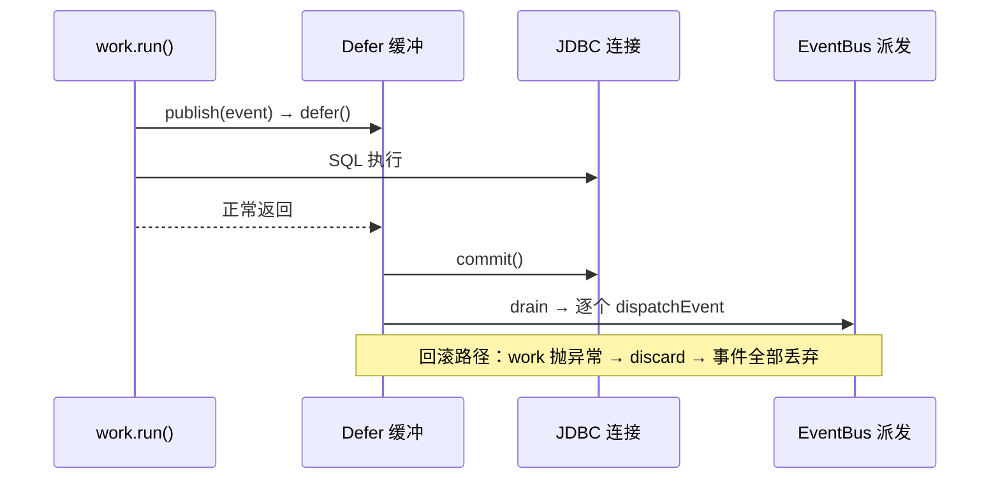

# Defer — 作用域延迟执行机制

## 一句话

**"当前边界成功提交后再执行副作用，翻车就丢弃。"** Defer 是 freeway-commons 中的通用延迟执行工具，基于 JDK 的 `ScopedValue` 实现，零外部依赖。它负责“提交后再做”的副作用；`ScopedCache` 则负责“作用域内复用、退出时清理”的值缓存。两者是 Freeway 的两个 scoped 机制。

## 心智模型：提交托盘

想象你有一个托盘。在工作过程中，你把写有待办事项的纸条扔进托盘。工作成功完成 → 逐条处理托盘中的纸条。工作失败 → 整个托盘倒掉，什么都没发生。

```java
Defer.within(() → {              // 托盘就位
    doWork();                    // 核心工作
    Defer.defer(() → sideA());   // 纸条 A → 托盘
    Defer.defer(() → sideB());   // 纸条 B → 托盘
});                              // 成功 → A 跑、B 跑
                                 // 异常 → A、B 全丢
```

在作用域外调用 `Defer.defer()` ？托盘不存在，立即执行。调用方不需要知道自己是否在作用域内。

## 核心 API

| API | 说明 |
|-----|------|
| `Defer.within(Runnable)` | 打开作用域，正常返回则排空，抛异常则丢弃 |
| `Defer.within(Consumer<DeferScope>)` | 同上，但可通过 `DeferScope.rollback()` 不回抛直接丢弃 |
| `Defer.defer(Runnable)` | 作用域内入列，作用域外立即跑 |
| `Defer.defer(String id, Runnable)` | 命名动作，返回 `DeferAction` 可链式 `.before(id)` / `.after(id)` |
| `Defer.supply(Callable<T>)` | 延迟值，返回 `Supplier<T>`，首次 `get()` 计算并缓存；从未 `get()` 则在提交时计算 |
| `Defer.supply(String id, Callable<T>)` | 命名延迟值，返回 `DeferAction`，支持排序和 `.value()` 取值；作用域外立即执行 |
| `Defer.isActive()` | 是否在作用域内 |

## 使用示例

### 基础：打开作用域，推迟执行

作用域正常返回 → 所有延迟动作按注册顺序执行。作用域抛异常 → 全部丢弃。

```java
// 作用域内 —— 动作被缓冲
Defer.within(() → {
    System.out.println("① 开始工作");
    Defer.defer(() → System.out.println("③ 副作用 A"));   // 入列
    Defer.defer(() → System.out.println("④ 副作用 B"));   // 入列
    System.out.println("② 工作完成");
});
// 输出顺序：① 开始工作 → ② 工作完成 → ③ 副作用 A → ④ 副作用 B

// 作用域外 —— 立即执行
Defer.defer(() → System.out.println("直接跑"));           // 立即输出
```

### 命名 + 排序

给动作一个名字，然后声明它必须在谁之前 / 之后执行：

```java
Defer.within(() → {
    Defer.defer("index",  () → rebuildIndex());           // 无约束，自由浮动
    Defer.defer("cache",  () → clearCache()).after("index");  // 必须在 index 之后
    Defer.defer("notify", () → sendNotification()).after("cache", "index");  // 最后
});
// 执行顺序：index → cache → notify

// 支持 before
Defer.defer("prep", () → prepare()).before("index");      // 必须在 index 之前
// 执行顺序：prep → index → cache → notify
```

约束规则：
- 缺省目标（引用了不存在的 id）→ 静默忽略，不报错
- 重复 id → `IllegalStateException`
- 循环依赖 → `IllegalStateException`
- 执行分组：受约束命名（拓扑序）→ 无约束命名（注册序）→ 匿名（注册序）——
  命名动作整体先于匿名动作，即使匿名更早注册；需要严格注册序时全部用匿名或全部用命名

### 手动回滚

不想抛异常但想丢弃延迟动作：

```java
Defer.within(scope → {
    preCheck();
    Defer.defer(() → doAfterSuccess());

    if (failedPreCheck) {
        scope.rollback();   // doAfterSuccess 不会执行
        return;             // 正常返回，不抛异常
    }

    doMainWork();           // 正常流程继续
});
// 如果 rollback() 被调用，作用域正常结束但动作全丢
```

### 延迟值

`supply()` 返回一个 `Supplier<T>`。作用域内：首次 `get()` 即时计算并缓存；如果从未调用 `get()`，则在作用域提交时计算一次。作用域外：每次 `get()` 即时计算。

```java
// —— 作用域内 ——
Supplier<String> cache;

Defer.within(() → {
    cache = Defer.supply(() → expensiveQuery());   // 还没算
    doWork();
});
String result = cache.get();  // 首次 get() 即计算，后续 get() 返回缓存
String again = cache.get();   // 不重新算，直接返回缓存

// —— 作用域外 ——
Supplier<String> s = Defer.supply(() → expensiveQuery());
s.get();  // 立即算，每次 get() 都重新算
```

### 检查是否在作用域内

```java
void maybeDefer() {
    if (Defer.isActive()) {
        Defer.defer(() → System.out.println("延迟的"));
    } else {
        System.out.println("立即的");
    }
}
```

### 嵌套作用域

内层作用域独立于外层——各自的成功/回滚互不影响：

```java
Defer.within(() → {
    Defer.defer(() → log.add("外层-前"));

    Defer.within(() → {
        Defer.defer(() → log.add("内层"));           // 内层立即排出
    });                                               // 内层失败不影响外层

    Defer.defer(() → log.add("外层-后"));
});
// 输出：内层 → 外层-前 → 外层-后
```

## 场景驱动

### 场景一：DB 事务 + EventBus（框架内建，用户零代码）

最常用的场景——你什么 Defer 代码都不需要写，框架自动处理：

```java
db.transaction(() → {
    db.execute("INSERT INTO posts ...");
    bus.publish(new PostCreatedEvent(post));     // 看似立即，实际被延迟
    db.execute("UPDATE counts ...");
});
// 提交成功 → 事件发布
// 回滚     → 事件不发

// 同一个 bus.publish()，在事务外调用就是立刻发送——用户不需要区分
bus.publish(new SomeOtherEvent());              // 立即发布
```

#### 三方接线（代码级）

三个组件通过 commons 的 `Defer` 解耦协作，db 不依赖 ioc，ioc 也不依赖 db：

```java
// freeway-db · DatabaseImpl.transaction() —— 打开 Defer 作用域，提交在作用域内
Defer.within(() -> {
    ScopedValue.where(tx, binding).run(() -> work.run());   // ① work 执行
    raw.commit();                                            // ② 提交
});                                                          // ③ 出作用域 → drain → 事件派发

// freeway-ioc · EventBus.publish() —— 探测作用域，活动则入列
if (Defer.isActive() && !(event instanceof DeadEvent)) {
    Defer.defer(() -> dispatchEvent(event));
}
```

#### 时序



#### 时序契约与语义边界

- **提交在 drain 之前**——事件只在提交成功后派发；回滚时 `Defer` discard，事件整体丢弃。**事件与事务同生共死**，不会出现"回滚了但事件发了"。
- **`Error` 路径**：work 抛 `Error`（如 `AssertionError`）→ `Defer.within` 的 `catch(Throwable)` discard + rethrow → `transaction()` 的 `catch(Throwable)` 执行 rollback。修复前只 catch `Exception`，`Error` 漏过回滚、恢复连接状态时的 `setAutoCommit(true)` 反而把失败事务提交了。
- **drain 失败边界（已知，未改）**：事件处理器抛异常发生在 commit **之后**——`Defer.within` discard + rethrow → `transaction()` 再尝试 rollback（已提交，无效果）并 rethrow。结果是"事务已提交但调用方看到失败"，事件部分派发。这是可辩护的语义（事件是工作单元的一部分），保持现状。
- **跨线程**：`ScopedValue` 绑定在当前线程，不传播到子线程。子线程里 `Defer.isActive()` 为 false，`publish()` 立即派发、不受事务保护；`publishAsync` 也因此保留立即语义（不参与 Defer）。

### 场景二：DB 事务 + 缓存失效（手动 defer）

```java
db.transaction(() → {
    db.execute("UPDATE posts SET title = ? WHERE id = ?", title, id);
    Defer.defer(() → cache.invalidate("posts:" + id));
    // 缓存只在 UPDATE 真正提交后才失效
});
```

### 场景三：HTTP 请求生命周期

```java
Defer.within(scope → {
    handleRequest(req, res);                       // 核心处理
    Defer.defer(() → metrics.record(method, duration));  // 指标
    Defer.defer(() → accessLog.write(entry));            // 访问日志

    if (res.status() >= 400) {
        scope.rollback();  // 错误响应不能当作成功请求统计
        return;
    }
});
// 只有成功的请求才会记录指标和访问日志
```

### 场景四：Kafka 消费——offset 提交边界

```java
Defer.within(() → {
    for (var record : records) {
        process(record);
        Defer.defer(() → bus.publish(new RecordProcessed(record)));
    }
    consumer.commitSync();  // offset 确认
});
// 事件只在 offset 提交成功后发布
```

### 场景五：批处理——全部或全不

```java
Defer.within(() → {
    for (var row : rows) {
        db.execute("INSERT INTO ledger (amount, memo) VALUES (?, ?)", row.amount, row.memo);
    }
    Defer.defer("index",  () → searchIndex.rebuild()).after("stats");
    Defer.defer("stats",  () → stats.refresh());
    Defer.defer("notify", () → bus.publish(new BatchDone())).after("index");
});
// 所有 INSERT 全部提交后：stats → index → notify 按序执行
// 任意一条失败 → 全部丢弃
```

### 场景六：延迟值——审计快照

```java
Supplier<AuditSnapshot> snap = Defer.supply(() → snapshotDao.build());

db.transaction(() → {
    orderService.place(order);
    // snapshotDao.build() 还没跑——推迟到提交后
});

// 事务已提交，snapshot 反映的是一致性状态
AuditSnapshot s = snap.get();
```

在作用域外，`supply()` 返回的 Supplier 每次 `get()` 都即时计算，不使用缓存。

## 驱动边界

Defer 本身是通用的。任何有"成功 / 回滚"语义的边界都可以用：

| 边界类型 | 谁打开作用域 | 提交时机 | 回滚时机 |
|---------|------------|---------|---------|
| DB 事务 | `DatabaseImpl.transaction()` | `raw.commit()` 成功 | 工作抛异常 |
| HTTP 请求 | Filter / 框架层 | 响应写入后 | 请求处理异常或手动 `rollback()` |
| Kafka 消费 | Consumer 循环 | `commitSync()` 后 | 处理异常 |
| 批处理 Job | Job 执行器 | 全部批次写完 | 任意步骤失败 |
| 自定义业务 | 你自己的 Service 层 | lambda 正常返回 | 抛异常或手动 `rollback()` |

## 与 ScopedCache 的嵌套契约

Defer 与 ScopedCache 是**独立的两个 scoped 原语**（各自独立的 `ScopedValue`），互相不知道对方存在——因此嵌套时**没有强制顺序**，只有一条约定：

**安全方向：`ScopedCache.within` 在外、`Defer.within` 在内。**

```java
ScopedCache.within(() -> {
    Defer.within(() -> {
        Object v = ScopedCache.get(k, factory);
        Defer.defer(() -> use(v));   // drain 时 cache session 仍打开 → v 可用 ✓
    });
});
```

**危险方向：`Defer.within` 在外、`ScopedCache.within` 在内。** 内层 cache 作用域退出时清理缓存值，而外层 Defer 的延迟动作**之后**才执行——延迟动作触碰缓存资源时它已关闭（use-after-close，静默或最坏时机抛错）：

```java
Defer.within(() -> {
    ScopedCache.within(() -> {
        Object v = ScopedCache.get(k, factory);
        Defer.defer(() -> use(v));   // drain 时 v 已被 cache 清理 → 已关闭 ✗
    });
});
```

`ScopedCache.within` 会在检测到危险嵌套时**输出一次 WARN**（每 JVM 一次），提示改为安全方向。框架自身不嵌套这两个原语（事务边界用 Defer、`container.scoped()` 用 ScopedCache，互不嵌套）——此契约只约束用户组合。

## 何时不用

- **清理逻辑**（如关闭流、释放锁）——用 `try/finally`。Defer 只处理"成功后才做"的副作用，失败时会丢弃。
- **跨线程的 fire-and-forget**——`ScopedValue` 绑定在当前线程。`publishAsync` 就是为此保留立即语义（不参与 Defer）。
- **长时间异步任务**——延迟动作在作用域排出时内联执行。如需异步之后再做，在延迟动作内部提交给线程池：`Defer.defer(() → executor.submit(heavy))`。

## 实现

`Defer` 内部只是一个 `ScopedValue<List<Runnable>>`。作用域内，`defer()` 追加到列表；作用域外，直接 `run()`。提交时遍历执行，回滚时清空。线程天然隔离——不同线程的工作互不干扰，虚拟线程也适用。`ScopedCache` 采用同类的作用域绑定方式，但缓存的是值而不是动作。
